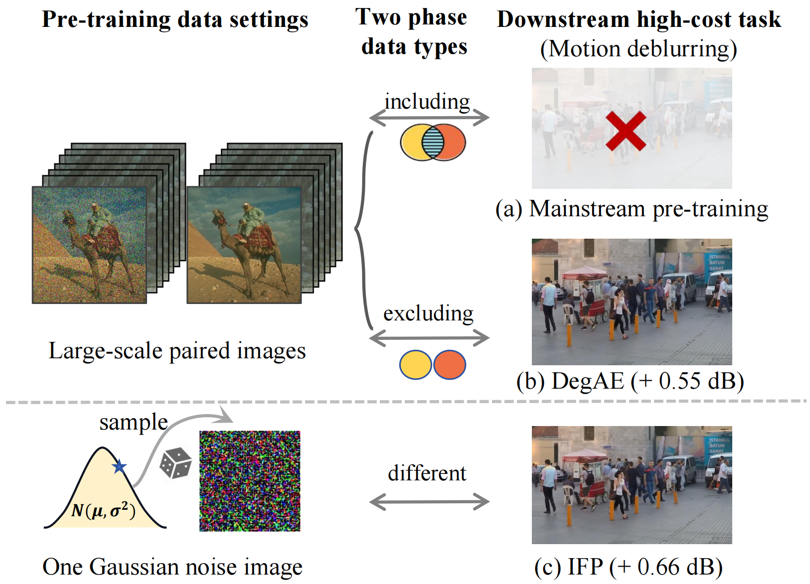

# Image-free Pre-training for Low-level Vision

This repository contains the official implementation of the ACM MM 2024 paper [Image-free Pre-training for Low-level Vision](https://dl.acm.org/doi/abs/10.1145/3664647.3681230). 

## Abstract
>The constrained data scale in low-level vision often induces the demon overfitting hazard for restoration networks, necessitating the adoption of the pre-training paradigm. Mirroring the success of the high-level pre-training approaches, recent methods in the low-level community aim to derive general visual representation from extensive data with synthesized degradation. In this paper, we propose a new perspective beyond the data-driven image pre-training paradigm for low-level vision, building upon the following examination. First, unlike the semantic extraction prevalent in high-level vision, low-level vision primarily focuses on the continuous and content-agnostic pixel-level regression, indicating that the diversified contents inherent in large-scale data are potentially unnecessary for low-level vision pre-training.Second, considering the low-level degradations are highly relevant to the frequency spectrum, we discern that the low-level pre-training paradigm can be implemented in the Fourier space with fostered degradation sensibility. Therefore, we develop an Image-free Pre-training (IFP) paradigm, a novel low-level pre-training approach with necessity of single randomly sampled Gaussian noise image, streamlining complicated data collection and synthesis procedure. The principle of the IFP involves reconstructing the original Gaussian noise from the randomly perturbed counterpart with partially masked spectrum band, facilitating the capability for robust spectrum representation extraction in response to the capricious downstream degradations.Extensive experiments demonstrate the significant improvements brought by IFP to various downstream tasks, such as 1.31 dB boost in low-light enhancement for Restormer, and improvements of 1.2 dB in deblurring, and 2.42 dB in deraining for Uformer. 



## Requirements
You can install the required libraries for `IFP` by the following command:

```
pip install -r requirements.txt
```

## Pretrained Models
Coming Soon.

## Data preparing
- The data structure is like this:
  ```
  dataset
  ├── noise
  │  ├── xxx.jpg
  ```

## Pretraining

Test the pretext task with Restormer backbone.
```
bash dist_pretrain.sh configs/restormer/restormer_pretrain_mMask.yaml 1 
```


## Downstream Tasks

The fine-tuning process aligns with DegAE, and for the codes related to downstream tasks, please refer to [DegAE](https://github.com/lyh-18/DegAE_DegradationAutoencoder).

## Citation

```
@inproceedings{wang2024image,
  title={Image-free Pre-training for Low-Level Vision},
  author={Wang, Siyang and Zhang, Jinghao and Huang, Jie and Zhao, Feng},
  booktitle={Proceedings of the 32nd ACM International Conference on Multimedia},
  pages={8825--8834},
  year={2024}
}
```

## Acknowledgements

This code is built upon [MFM](https://github.com/Jiahao000/MFM) and [DegAE](https://github.com/lyh-18/DegAE_DegradationAutoencoder), thanks for their excellent work!
